# esp32-sensors

Used for IoT data pipeline:

## 🔗 Complete IoT Pipeline

```mermaid
flowchart LR
    SENSORS["🧪 Sensors<br/>DHT11 • DHT20<br/>Gas • Light"]
    
    ESP["🔧 ESP32<br/>Measures every 5s"]
    
    MQTT["📡 MQTT Broker<br/>Port 1883<br/>iot/test/sensors"]
    
    NR["🔄 Node-RED<br/>Process & Rate Limit"]
    
    DB[("🗄️ PostgreSQL<br/>Persistent Storage")]
    
    GRAF["📊 Grafana<br/>Visualization"]

    SENSORS -->|Sensor readings| ESP
    ESP -->|JSON / MQTT Publish| MQTT
    MQTT -->|Subscribe| NR
    NR -->|Store e.g. every 30s| DB
    DB -->|SQL Query| GRAF

    classDef sensors fill:#dbeafe,stroke:#2563eb,stroke-width:2px,color:#111827
    classDef esp fill:#dcfce7,stroke:#16a34a,stroke-width:2px,color:#111827
    classDef mqtt fill:#fef3c7,stroke:#d97706,stroke-width:2px,color:#111827
    classDef nodered fill:#fee2e2,stroke:#dc2626,stroke-width:2px,color:#111827
    classDef database fill:#ede9fe,stroke:#7c3aed,stroke-width:2px,color:#111827
    classDef grafana fill:#ffedd5,stroke:#ea580c,stroke-width:2px,color:#111827

    class SENSORS sensors
    class ESP esp
    class MQTT mqtt
    class NR nodered
    class DB database
    class GRAF grafana
```



## ⚙️ Setup

🔗 References

→ [ESP32 WROOM-32D OLED Pinout](https://www.espboards.dev/esp32/esp32-wroom-32d-oled/)

→ [ELEGOO 37 Sensor Kit V2](https://www.fisicalive.altervista.org/Coding/37%20SENSOR%20KIT%20TUTORIAL%20FOR%20UNO%20AND%20MEGA%20v2.0.0.19.08.7.pdf)

---

## 🧩 Components

- ESP32 ESP-WROOM from diymore (Dev Board)
- 0.96" OLED (I2C, SSD1306)
- 2x Yellow LEDs (rail indicator)
- 220Ω resistors (for LEDs)
- 2x 100µF capacitors (power stabilization)
- DHT11 temperature / humidity sensor
- DHT20 temperature / humidity sensor
- Gas sensor
- Light sensor

---

## 🔌 Wiring Overview

### OLED (I2C)

- VCC → 3.3V
- GND → GND
- SDA → ESP32 I2C SDA
- SCL → ESP32 I2C SCL

---

### Power Rails

- Breadboard top + bottom rails powered
- Each rail has:
  - 1x LED (visual power indicator)
  - 1x 100µF capacitor (bulk stabilization)

---

## 💡 Design Decisions

### LEDs on rails

Used as **visual power indicators**:

- confirms power distribution (3.3V with approx. 5.5–7mA)
- useful for debugging and video clarity

⚠️ Note:

LED ≠ stable voltage indicator (only presence of voltage)

---

### 100µF Capacitors

Used for:

- buffering voltage drops
- stabilizing ESP32 + OLED during load spikes

⚠️ No small decoupling capacitors

---

# 📡 MQTT Communication

The ESP32 publishes sensor data to an MQTT broker.

### Data Flow

```text
Sensors
   ↓
ESP32
   ↓
Wi-Fi
   ↓
MQTT Broker
   ↓
Node-RED
```

The ESP32 is responsible for:

Reading the connected sensors

- Preparing the sensor values
- Connecting to the local Wi-Fi network
- Connecting to the MQTT broker
- Publishing the sensor data

The ESP32 does not handle database storage or data visualization.

---

## 🌐 Wi-Fi

The ESP32 connects to the local Wi-Fi network before establishing the MQTT connection.

```text
ESP32
  │
  └── Wi-Fi → Local Network
```

---

## 📡 MQTT Broker

The ESP32 connects to a local MQTT broker.

### Broker

```text
Host: <MQTT_BROKER_IP>
Port: 1883
Protocol: MQTT
```

---

### 📬 MQTT Topic

Sensor data is published to:

iot/test/sensors

The topic contains the current sensor measurements.

##### Example MQTT message:

```text
{
  "dht11_temperature": 26.1,
  "dht11_humidity": 48,
  "dht20_temperature": 26.55,
  "dht20_humidity": 50.2,
  "gas_raw": 249.8,
  "light": 123
}
```

---

### 📦 Message Format

Sensor data is transmitted as JSON.

This allows multiple sensor values to be transported in a single MQTT message.

```text
Sensor readings
↓
JSON object
↓
MQTT publish
↓
iot/test/sensors
```

The JSON format also makes the data easy to process in Node-RED.

---
